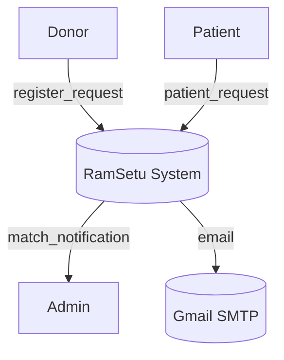

# Data Flow Diagrams (DFD) 

This document explains Data Flow Diagrams (DFDs): what they are, standard symbols, levels (Context/Level 0/Level 1...), and practical examples mapped to the RamSetu organ-donation system. It also gives best practices for creating clear, valuable DFDs for engineering and stakeholders.

## What is a DFD?
- A Data Flow Diagram (DFD) models how data moves through a system: sources, processes, data stores, and sinks.
- Purpose: clarify information movement and responsibilities without showing implementation details (servers, code).

## Core DFD elements & symbols
- External Entity (Actor): rectangle — a system or user outside the system boundary that sends/receives data (e.g., Donor, Patient, Admin, External SMTP).
- Process: rounded rectangle or circle — transforms data (e.g., Match Engine, Auth Service).
- Data Flow: arrow — labelled with the data moving between elements (e.g., `donor_profile`, `match_request`, `email_notification`).
- Data Store: open-ended rectangle (two parallel lines) — persistent store of data (e.g., `Donors`, `Patients`, `Matches`, `ML_Models`).
- Boundary: optional box that groups processes that belong to the system being modeled.

## DFD Levels (what they mean)
- Context Diagram (Level 0): the highest-level view — single process representing the entire system and its external entities and data flows. Used for stakeholders.
- Level 1: decomposes the single system process into 4–8 major sub-processes showing top-level interactions and data stores.
- Level 2+: further decomposition of a selected Level 1 process into finer-grained processes and flows.

## Example: Context Diagram (RamSetu)

Elements:
- External Entities: `Donor`, `Patient`, `Admin`, `Gmail SMTP`
- System (single process): `RamSetu System`
- Data flows: `register_request`, `patient_request`, `match_notification`, `email`

Flow (textual):
- `Donor` → `register_request` → `RamSetu System`
- `Patient` → `patient_request` → `RamSetu System`
- `RamSetu System` → `match_notification` → `Admin`
- `RamSetu System` → `email` → `Gmail SMTP`

This gives a clear stakeholder-level view: who interacts and what major data passes between parties.

## Example: Level 1 DFD (RamSetu)

Decompose `RamSetu System` into top processes and stores:
- Processes:
  1. `Auth & User Management` (handle registrations, JWT auth)
  2. `Donation & Request Management` (create/update donor/patient requests)
  3. `Match Engine` (orchestrates ML scoring and ranking)
  4. `Notification Service` (email, in-app notifications)
- Data Stores:
  - `DB: Users/Donors/Patients/Requests/Matches` (MongoDB)
  - `ML Storage` (models, artifacts)

Key flows:
- `Donor` → `register` → `Auth & User Management` → store `DonorProfile` in `DB`
- `Patient` → `submit_request` → `Donation & Request Management` → store `PatientRequest`
- `Donation & Request Management` → `match_request` → `Match Engine` → `ML Storage` (retrieve model) → `scores` → `Donation & Request Management` → store `Matches`
- `Match Engine` → `notification` → `Notification Service` → `Gmail SMTP`

Notes: label each arrow with the actual data payload (e.g., `donor_medical_profile`, `compatibility_scores`).

## Mapping to implementation (useful checklist)
- External Entity → map to frontend actors or external services (React apps, SMTP)
- Process → map to API endpoints, controllers, microservices (e.g., `MatchController`, `ml_api`)
- Data Store → map to concrete DB collections (e.g., `Donor` collection in MongoDB)
- Data Flow → map to request/response payloads and event messages (REST body, queue message format)

Example mapping (RamSetu):
- `Match Engine` process → `ml_hybrid_module/predict_and_rank.py` / `ML API` service
- `Notification Service` → `server/utils/emailService.js` and background worker that reads `email_queue`
- `DB: Users/Donors/Patients` → `ramsetu-health-bridge-main/server/models/*.js`

## Best practices for clear DFDs
- Start with a Context Diagram (Level 0) — get stakeholder buy-in first.
- Use consistent symbol shapes, colors, and a legend — make flows readable.
- Keep each diagram focused: 4–8 processes per diagram for readability.
- Label every data flow clearly with the data name and format if helpful (e.g., JSON attributes).
- Show directionality and use arrowheads consistently.
- Avoid implementation details — keep DFDs about data movement not servers.
- For processes that are asynchronous (queues, events), use distinct arrow style or annotate `(async)`.
- Validate with engineers: confirm that each data flow corresponds to a real API, event, or DB operation.

## Tools & export formats
- Draw.io / diagrams.net — free, easy; exports PNG/SVG
- Lucidchart — collaborative (paid)
- Mermaid — text-based diagrams suitable for embedding in `README.md` and docs; good for Level 0/1 quick views
- Visio — enterprise-focused

## Example Mermaid (Level 0) snippet

## From DFD to implementation: checklist
- For each data flow, identify the API endpoint or queue topic.
- For each process, identify the responsible code module, file, or microservice.
- For each data store, list collections/tables and retention/backups required.
- Add security notes: which flows must be encrypted (TLS), which stores require at-rest encryption, and which APIs require authorization.

## Common mistakes to avoid
- Overloading a single diagram with too many processes and flows
- Using ambiguous labels like `data` — prefer `donor_profile`, `compatibility_scores`
- Mixing UI/layout details with data movement (keep DFDs implementation-agnostic)

## Next steps (suggested for this repo)
- Add a simple Mermaid Level 0 diagram to `README.md` for stakeholders.
- Create a Level 1 DFD image (Draw.io) and store it in `Images/dfd-level1.png` with a legend.
- Link each DFD element to corresponding code locations in the repository for traceability.

---
If you want, I can now:
- generate the Mermaid Level 0 and insert it into the top-level `README.md`, or
- create a Draw.io Level 1 diagram file and add a high-resolution PNG + legend to `Images/`.
