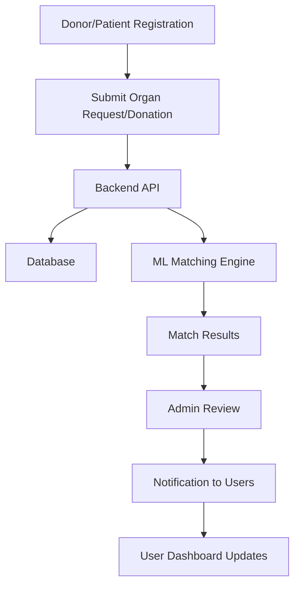
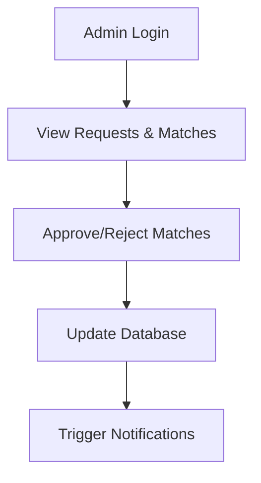
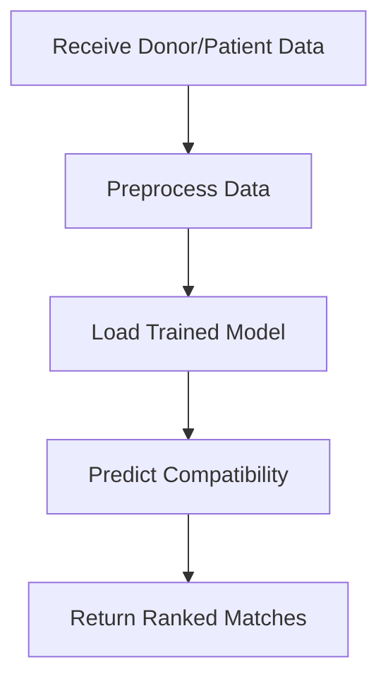
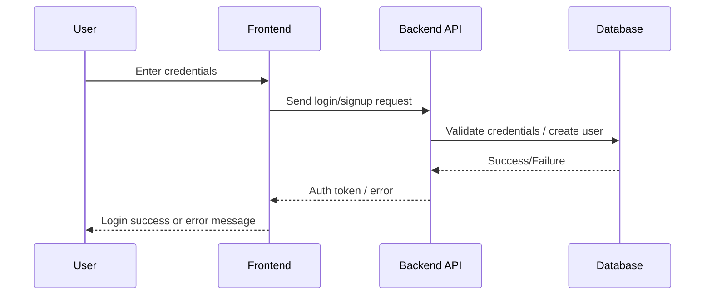
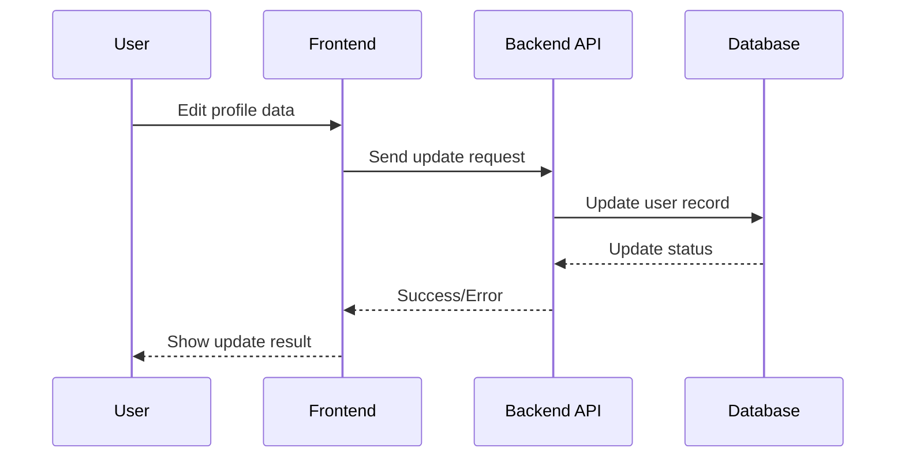
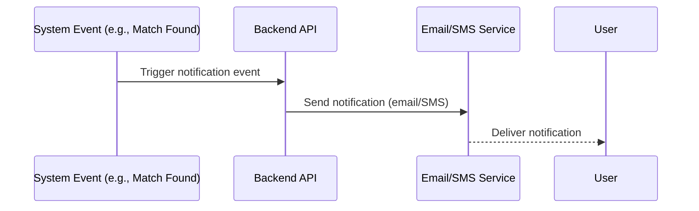
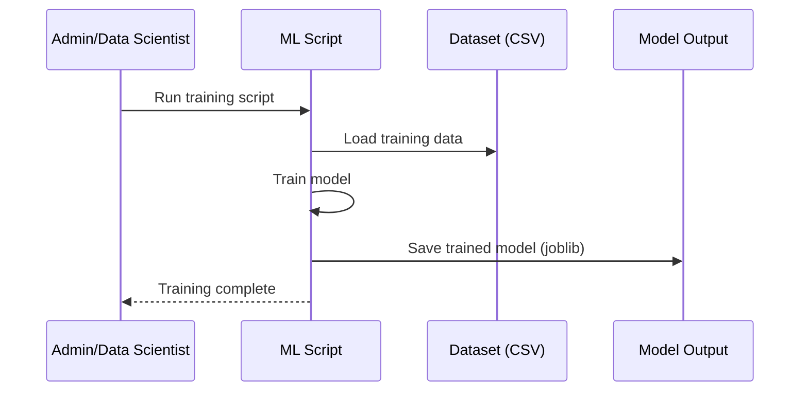

# RamSetu Health Bridge – System Flow & DFDs

This document provides a high-level overview of the system architecture, user flows, and Data Flow Diagrams (DFDs) for the RamSetu Health Bridge platform.

---

## 1. System Overview

RamSetu Health Bridge is a modular platform for organ donation and matching, featuring:
- User Portal (Patients & Donors)
- Admin Dashboard
- Backend API
- Machine Learning Module

---

## 2. User Flow Chart



---

## 3. Admin Flow Chart



---

## 4. Data Flow Diagram (DFD – Level 1)

```mermaid
graph TD
    User[User (Donor/Patient)] -->|Registration/Request| API[Backend API]
    API -->|Store/Retrieve| DB[(Database)]
    API -->|Send Data| ML[ML Module]
    ML -->|Match Results| API
    API -->|Notify| Admin[Admin]
    Admin -->|Review/Action| API
    API -->|Status Updates| User
```

---

## 5. Machine Learning Module Flow



---

## 6. Notes
- Diagrams are in Mermaid.js syntax and can be rendered in supported Markdown viewers or online editors (e.g., mermaid.live).
- For detailed ER diagrams or sequence diagrams, see the /docs or contact the project maintainers.

---

## 7. References
- [Mermaid Live Editor](https://mermaid.live/)
- [Project Main README](./README.md)

---

## 8. Additional Technical Flows

### 8.1 Authentication Flow


### 8.2 Data Update Flow (e.g., Donor/Patient Profile)


### 8.3 Notification Flow


### 8.4 Machine Learning Model Training Flow

